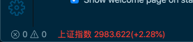

# stocks-vscode

Extension for track stocks in the VSCode status bar.

## Features

Give some stock symbols, refresh them every `stocks.refreshInterval` seconds then loop each in the status bar every `stocks.loopInterval` seconds.



## Extension Settings

- `stocks.enable`: Enable/disable this extension.
- `stocks.refreshInterval`: Seconds interval for refreshing symbols from remote, default is 60.
- `stocks.loopInterval` : Seconds interval for loop each symbol in the status bar, default is 3.
- `stocks.positiveColor`: Highlight colors (green and red) for symbols when up and down, positiveColor for up, the other for down.
- `stocks.positiveColor`: Show percentage of up and down.
- `stocks.symbols`: The list of stock symbols track in the status bar.

Settings example:

```json
{
  "stocks.positiveColor": "green",
  "stocks.showPercentage": true,
  "stocks.symbols": ["sh000001", "sh601398", "sh510050", "sh513880"]
}
```
